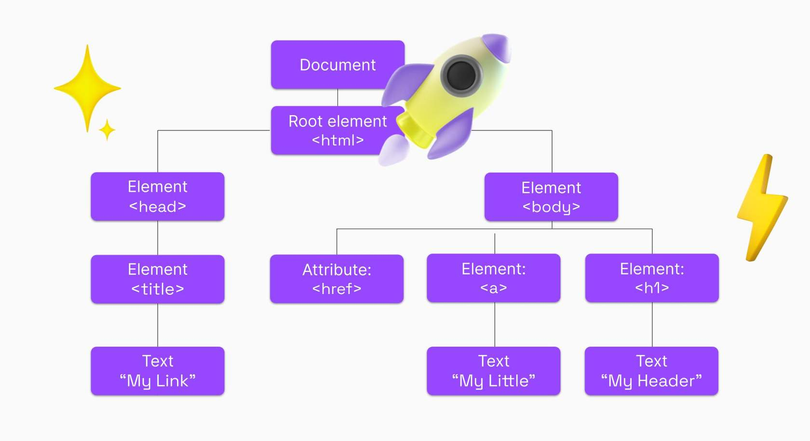
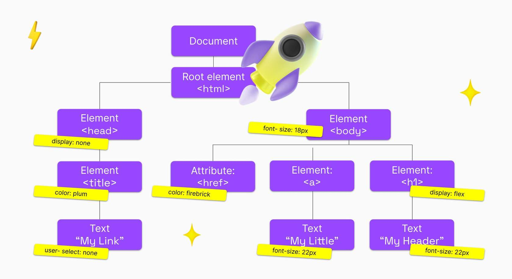
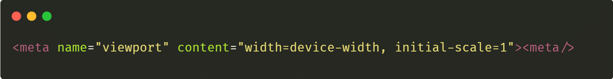
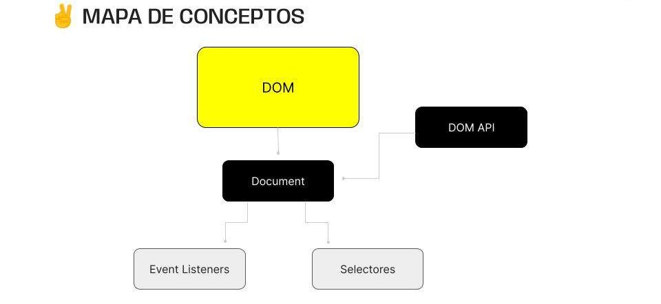

> # ***Modulo 1 - Clase 03: DOM (Document Object Model)***
***

> ## ***Objetivos***

* ### *Conocer DOM y aprender acerca del ciclo de vida de una página web.*

* ### *Interactuar con el DOM mediante la DOM API para manipular elementos de la página web.*

* ### *Comprender la naturaleza y gestión de eventos en el contexto web.*

* ### *Aplicar nuevas técnicas de prompting con ChatGPT.*

> ## ***Construcción web***

* ### **Render**

  En primera instancia, veamos brevemente cómo es el proceso de render de una página web sobre todo su contenido. Es decir, cómo se inicializa una página cuando ingresamos a ella.

  1. #### ***DOM***

    * El primer paso es la construcción del DOM a partir de un documento de HTML guardado en la nube. El DOM es una representación estructurada de una página web. Se parece a un árbol, donde cada etiqueta HTML es un nodo, incluyendo textos e imágenes.

      

  2. #### ***CSSOM***

    * En segunda instancia se hace la construcción del CSSOM que es un modelo que representa los estilos asociados al DOM. El CSSOM es similar al DOM, pero se enfoca en el estilo de la página.

      

  3. #### ***RENDER TREE***

    * Lo siguiente es la creación del Render Tree, el cual es una combinación del DOM y el CSSOM que se enfoca únicamente en aquellos elementos del documento HTML que son visibles en la página. Este árbol representa todos los elementos visuales de la página y sus estilos, y es lo que el navegador utiliza para pintar la página en la pantalla. 

      

  4. #### ***LAYOUT***

    * El layout de una página determina el tamaño del dispositivo de salida (viewport) dando así contexto a los estilos que dependen de él. Este viewport puede ser configurado dentro de la etiqueta <meta> donde podemos modificar sus medidas y la escala inicial de mi página. El layout es el cálculo de las posiciones y tamaños de los elementos en la página. Antes de pintar los elementos, el navegador necesita saber dónde y qué tan grandes deben ser.

> ## ***DOM***

* ### **¿Qué es?**

  Originalmente, los sitios web no eran más que conjuntos de páginas de texto plano con poca interactividad con el usuario. A medida que fue surgiendo la necesidad de mejorar la experiencia y la personalización de los sitios (diseños más atractivos, funcionalidades más complejas, etc.), se descubrió que era necesario tener acceso a los elementos que los componen, así como también permitir la comunicación entre estos, dando lugar a la implementación del DOM.
  
  El Document Object Model (DOM), es una estructura jerárquica en forma de árbol que representa todos los elementos de una página web. Para crear este objeto DOM, el navegador que lee el documento HTML toma parte por parte de este archivo, desde el elemento html (también llamado root) hasta las últimas etiquetas, y devuelve un objeto basado en su estructura y cuyo comportamiento será controlado a través de scripts JS.

> ## ***DOM API***

* ### **¿Qué es?**

  El DOM API (Document Object Model Application Programming Interface) es un conjunto de interfaces y métodos proporcionados por los navegadores para permitir que los scripts de nuestro código interactúen con el DOM.  
  Es gracias a esta serie de métodos que podemos manipular, transformar y crear elementos dentro de un página web.

* ### **Acciones que podemos realizar con el DOM API**

  1. **Selección de elementos:** Permitir la identificación y selección de elementos en el DOM, ya sea por etiqueta, clase, ID u otros selectores CSS.

  2. **Manipulación de contenido:** Crear, modificar o eliminar el contenido de los elementos, como atributos, textos, etc.

  3. **Estilo y presentación:** Modificar el estilo de los elementos para cambiar aspectos como el color, tamaño, posición, etc.

  4. **Eventos:** Asociar funciones o scripts a eventos del usuario, como clics, teclas presionadas, entre otros, para crear interactividad.

  5. **Navegación:** Recorrer la estructura del DOM, accediendo a nodos padres, hijos o hermanos.

> ## ***Selectores***

* ### **¿Qué es?**

  Frecuentemente nos referimos bajo el nombre de “selector” a aquellos métodos y propiedades que nos permiten seleccionar elementos específicos de una página web, sin necesidad de afectar la naturaleza y el comportamiento de otros elementos del DOM.

> ## **Eventos**

* ### **Trabajando con eventos**

  Llamamos Evento a las distintas interacciones/acciones que tenemos con los elementos html que seleccionados con selectores.

  Un ejemplo sencillo de analizar es por ejemplo cuando le damos click en la pantalla y algo sucede. También podría ser un doble click. Otro evento muy común es el de hacer scroll sobre un elemento, o presionar una tecla, o llenar un campo de texto.

* ### **Event listener**

  De la misma forma que podemos asociar un elemento del DOM con un evento, también vamos a poder asociarlo con un event listener. Estos son simplemente métodos que se complementan con los eventos. Estas funciones son las disparadoras de una lógica al momento de realizarse un evento.

  ```javascript
  // Selecciona el botón por su ID
  const loginButton = document.getElementById('loginButton');

  // Función que se ejecutará cuando se haga click en el botón 
  function handleLoginClick() {
    console.log('Iniciando sesion ...');
  }

  // Agrega el evento de click al botón
  loginButton.addEventListener('click', handleLoginClick);
  ```

  #### **Un event listener recibe dos argumentos. Primero, el evento ("click") y luego un callback (función de login).**

* ### **Métodos más comunes**

  |**MÉTODO**| **FUNCIÓN** |
  |:--------:|:-----------:|
  |***document.getElementById(id)***|Retorna una referencia al elemento del DOM que tiene el id especificado.|
  |***document.getElementsByClassName(className)***|Retorna una colección de elementos del DOM que tienen la clase CSS especificada.|
  |***document.querySelector(selector)***|Retorna el primer elemento del DOM que coincide con el selector CSS especificado.|
  |***document.querySelectorAll(selector)***|Retorna todos los elementos del DOM que coinciden con el selector CSS especificado.|
  |***element.textContent***|Permite acceder o modificar el contenido de texto de un elemento.|
  |***element.appendChild(childElement)***|Agrega un nuevo hijo al final de la lista de hijos de un elemento.|

* ### [**Otros Metodos**](https://developer.mozilla.org/es/docs/Web/API/Document_Object_Model)

> ## ***Meta Prompting***

* ### **¿Qué es?**

  El término metaprompt fue por primera vez utilizado el 19 de septiembre de 2022 por David Shapiro. Este investigador de IA define al metaprompt como “Todos aquellos prompts que sirven para generar nuevos prompts”. Es decir, utilizar la IA para que genere sus propios prompts.

  En lugar de diseñar un prompt específico para una tarea en particular, este método se centra en obtener un prompt general para la tarea que facilita una adaptación más rápida y efectiva a nuevas tareas de prompting. Podríamos pensarlo como un prompting recursivo.

  #### ***El metaprompting es una estrategia que nos permite obtener información más precisa, y mucho más rápida.***

> ## ***Hiperparámetros***

* ### **¿Qué es?**

  Los hiperparámetros son configuraciones ajustables que determinan cómo funciona el modelo.

* ### **Temperature**

  Este parámetro afecta el grado de aleatoriedad de los outputs del modelo.

  * #### **Valores de Temperature**

    El valor que puede recibir este hiper parámetro es un número que va del 0 al 1.

    * **Cuando el valor es bajo (cerca de 0):** Hará que las respuestas sean más enfocadas y consistentes, aunque también con menos creatividad y variedad.

      Ejemplo con [**Temperature 0**](https://chat.openai.com/share/a0906964-761d-47c2-91e0-7c20293b01ea)

    * **Un valor más alto (cerca de 1):** Aumentará la diversidad y la creatividad de los outputs, pero también puede llevar a resultados más impredecibles y posiblemente menos precisos.

      Ejemplo con [**Temperature 1**](https://chat.openai.com/share/6ed75f4c-dc22-4dfb-85f5-90b2d2b29ba5)

* ### **Algunos hiperparámetros**

  * ***max_tokens:*** Define el número máximo de tokens que una respuesta puede contener. Limitar este valor puede ayudar a evitar respuestas demasiado largas o garantizar respuestas más concisas.

  * ***top_p:*** Controla la diversidad y la selectividad de las respuestas generadas. Un valor bajo (por ejemplo, 0.2) hace que el modelo se centre en las opciones más probables, mientras que un valor alto (por ejemplo, 0.8) permite opciones más diversas y menos probables. 

  * ***frequency_penalty:*** Penaliza las respuestas que repiten palabras o frases utilizadas anteriormente en la conversación. Un valor más alto (por ejemplo, 0.6) hará que el modelo evite repetir con mayor frecuencia las palabras utilizadas previamente.

  * ***num_return_sequences:*** Define el número de respuestas alternativas que se generan para una única solicitud. Puedes establecer este valor en 1 para obtener una única respuesta o aumentarlo para obtener múltiples respuestas.
***

> ## ***Cierre***

* ### **En conclusión...**

  * ***Comprendimos el Document Object Model (DOM):*** Hemos aprendido que el DOM actúa como una representación estructurada de nuestros documentos HTML organizando los elementos en una jerarquía que podemos manipular dinámicamente.

  * ***Al profundizar en el DOM API:*** Hemos adquirido habilidades para interactuar con él, conociendo algunos de los métodos más comunes dentro de la API que nos permiten identificar y acceder a elementos específicos de la página, métodos para la creación y manipulación de elementos en tiempo real y la capacidad de gestionar eventos generados por las acciones de un usuario dentro del navegador.

  
***