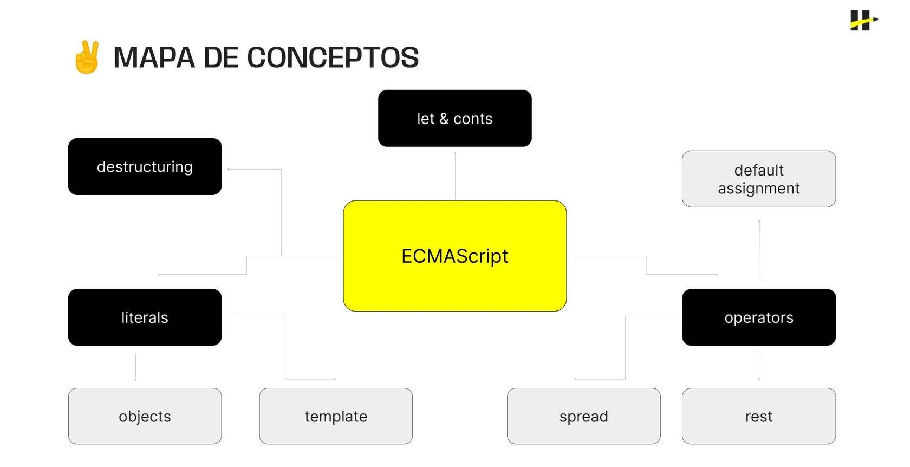

> # ***Modulo 1 - Clase 01: ECMAScript***

> ## ***Objetivos***

* ### *Dar contexto sobre qué es ECMAScript.* 

* ### *Presentar las nuevas features que ofrece JavaScript a partir de ECMAScript.* 

* ### *Demostrar cómo estas features se pueden utilizar en la programación del día a día.*

* ### *Presentar de forma introductoria a ChatGPT y dar un instrcutivo sobre cómo acceder.*

> ## ***ECMAScript***

* ### ¿Qué es?

    Las siglas ECMA hacen referencia a European Computer Manufacturers Association. Se trata de una organización internacional dedicada a la creación de estándares para la comunicación y la información fundada en 1960 por algunas de las compañías de tecnología más grandes a nivel mundial.

    ***(Esta organización se encarga de definir las reglas que rigen la información que consumimos mediante estándares creados y actualizados por la asociación)***

    * **[Estandares](https://ecma-international.org/publications-and-standards/standards/?_gl=1*1m6c3f0*_ga*MjAwODY1NzUxMy4xNjk5ODg2MDY2*_ga_TDCK4DWEPP*MTY5OTg4NjA2Ni4xLjEuMTY5OTg4NjE1NS4wLjAuMA&_ga=2.257569677.707186167.1699886068-2008657513.1699886066)**

    * **[Estandar 262](https://ecma-international.org/publications-and-standards/standards/ecma-262/)**

> ## ***Let & Const***

* ### **ECMAScript 6**

    En la actualidad, se encuentra vigente la versión 13 del estándar, pero a nivel global se considera que la última versión que realmente cambió las reglas del juego fue la versión 6 conocida como ECMAScript 6 (lanzada el año 2015).

    **[Versiones de ECMAScript](https://www.w3schools.com/js/js_versions.asp#:~:text=%2C)**

* ### **Let & Const**

    Esto ayudó a la modernización de JavaScript, alineándolo con lenguajes más avanzados y respondiendo a las necesidades de aplicaciones complejas. Estas nuevas declaraciones de variables mejoraron la seguridad y previsibilidad en la gestión de datos.

    * ***let:*** Permite declarar variables con alcance limitado al bloque de código donde se definen, en lugar del alcance completo de var.

    * ***const:*** Permite declarar constantes cuyo valor no puede ser reasignado una vez establecido. Indica que el valor debe permanecer inmutable.

* ### **Scope**

    El  scope  hace referencia a la región del código donde se definen las variables y, por lo tanto, donde pueden ser accedidas.

    * #### ***Scope Global***

        Cuando una variable se declara fuera de cualquier función o bloque de código, se convierte en una variable global y está disponible a lo largo de todo el programa.
        
        ```javascript
        var globalVariable = "Soy global";

        function ejemplo() {
          console.log(globalVariable);
        }

        console.log(globalVariable + " 2"); // "Soy global 2"
        ejemplo(); // "Soy global"

        // Tenemos acceso a la variable global desde dentro y fuera de una función
        ```

    * #### ***Scope Local***

        Cuando una variable se declara dentro de una función o un bloque de código se considera como una variable local y solo es accesible dentro de esa función o bloque. Esto ayuda a encapsular variables y evitar conflictos.

        ```javascript
        function ejemploScopeLocal() {
          var variableLocal = "Soy local";
          console.log(variableLocal);
        }

        ejemploScopeLocal(); // "Soy local"

        console.log(variableLocal); // ERROR
        // variableLocal no está definida fuera de la función.
        ```

    * #### ***Block Scope***

        Este tipo de scope permite declarar variables con alcance dentro de bloques de código, y no solo de funciones. Es decir, también se aceptan en condicionales, bucles, etc.

        ```javascript
        if (true) {
          let blockVariable = "Soy de alcance de bloque";
          console.log(blockVariable); // "Soy de alcance de bloque"
        }

        console.log(blockVariable); // ERROR
        // blockVariable no está definida fuera del bloque.
        ```

* ### **Hoisting**

    Este término se refiere a un comportamiento en JavaScript donde las declaraciones de las variables y funciones son "movidas" al inicio de su contexto de ejecución durante la fase de compilación, antes de que el código se ejecute. Esto significa que, las variables y funciones son "elevadas" (hoisted) a la parte superior de su ámbito (scope), lo que puede afectar la forma en que el código se ejecuta.

    Al declarar una variable con var, y al intentar acceder a ella antes de ser declarada, el código imprime "undefined". Esto se debe a que, a la hora de ejecutar el código, esa declaración se mueve al inicio del código. Por lo que, la variable ya existe aunque no tenga su valor asignado aún.

    ```javascript
    console.log(x); // undefined
    var x = 5;
    console.log(x); // 5
    ```

    Por lo contrario, si utilizamos let o const para declarar una variable (constante) este proceso ya no funciona igual que antes. Es decir, la declaración de la variable no se hoisteará al inicio de la ejecución.

    ```javascript
    console.log(y); // ERROR --> Cannot access 'y' before initialization
    const x = 5;
    console.log(y); // 5
    ```

> ## ***Object literals***

* ### **¿Qué más trajo ES6?**

    Otra de las grandes adiciones que trajo ECMAScript 6 a JavaScript fueron los Object Literals que nacieron como una forma más concisa de definir objetos mediante una sintaxis simplificada.

    * #### ***Antes***

        Esta era la forma antigua en la que se creaban objetos. Teníamos que acceder al objeto Object, y crear uno con la palabra reservada new.

        ```javascript
        // Antes de ES6
        var obj = new Object();
        obj.propiedad = "valor";
        ```

    * #### ***Ahora***

        ```javascript
        // Con ES6
        let obj = {
          propiedad: "valor"
        };
        ```

    * #### ***Propiedad Dinamica*** 

        En un objeto se puede crear una propiedad cuyo nombre puede definirse y cambiar en tiempo de ejecución.
        Esto permite crear y manipular propiedades de objetos de manera flexible, basandose en condiciones o valores variables.

        ```javascript
        var obj = {
          saludo: "Hola",
          saludar() {console.log(this.saludo)},
          ["prop" + "Dinamica"]: 10
        }

        console.log(obj.saludar()); // "Hola"
        console.log(obj.propDinamica); // 10
        ```

> ## ***Template literals***

* ### **Otra forma de trabajar con strings...**

    Los Template Literals también conocidos como Template Strings. Son una forma limpia y expresiva de crear strings dentro de los cuales es posible insertar expresiones de código directamente para concatenar su valor.

    ```javascript
    function antesDeES6(nombre, identidadSecreta) {
      console.log("Este es: " + nombre + " mejor conocido como: " + identidadSecreta);
    }

    function templateString(nombre, identidadSecreta) {
      console.log(`Este es: ${nombre} mejor conocido como: ${identidadSecreta}`);
    }
    ```

    En este ejemplo, antesDeES6 realiza un console.log de una frase en la que se interpolan strings y parámetros que recibe la función.

    Pero luego, en templateString podemos ver que esos parámetros ya no se adhieren al string mediante el operador (+). Por lo contrario, se insertan directamente dentro del string. ¿Cómo funciona esto?

    1. Para crear un template string, primero, es necesario utilizar los backsticks (``). De la misma manera que existen las comillas simples (' ') y las dobles (" "), existen estas nuevas comillas.

    2. Para insertar un elemento dentro de un string, necesitarás hacerlo dentro de un signo de dinero y llaves (${ }). De esta forma el string sabrá que este es un valor que estamos adhiriendo.

    En este ejemplo podemos ver como, a partir de dos constantes creadas dentro de la función crearMensaje nos permiten generar un string compuesto.

    ```javascript
    function crearMensaje() {
      const saludo = "Hola";
      const nombre = "Carlos";

      console.log(`${saludo}, ${nombre}!`)
    }
    ```

* ### **¿Qué es el [Scape Sequence](https://learn.microsoft.com/es-es/cpp/c-language/escape-sequences?view=msvc-170)?**

    Una secuencia de escape es una combinación de caracteres que representa un carácter especial en un string, como un salto de línea o un tabulador, y comienza con una barra invertida (\).

    ```javascript
    function imprimirMensaje() {
      console.log("Message:\n aquí hubo un salto de línea.")
    }
    ```

> ## ***Destructuring***

* ### **Nueva feature: destructuring**

    El destructuring nos permitirá "desempaquetar" o "extraer" todas las propiedades de un objeto para así poder acceder a ellas de manera más sencilla.

    ```javascript
    function crearPersona({nombre, apellido, edad}) {
      console.log(nombre, apellido, edad);
    }

    crearPersona({nombre: "Lucas", apellido: "Romero", edad: 22}); // Lucas Romero 22
    ```

> ## ***Spread & Rest operators***

* ### **Spread & Rest**

    En realidad, podríamos considerarlo como un solo operador ya que en los 2 casos se representa con tres puntos suspensivos (...), pero dependiendo de su posición y contexto cambia su función.

    * #### ***Spread Operator***

        ```javascript
        const perro = {
          raza: "Salchicha",
          nombre: "Pancho",
          edad: 3,
          color: "Marrón",
        };

        const perro2 = {...perro};

        perro.collar = true;

        console.log(perro2) // { raza: "Salchicha", nombre: "Pancho", edad: 3, color: "Marrón" };
        console.log(perro) // { raza: "Salchicha", nombre: "Pancho", edad: 3, color: "Marrón", collar: true };
        ```

    * #### ***Rest Operator***

        ```javascript
        function sumar(...numeros) {
          console.log(numeros);
          
          let suma = 0;

          for (let i = 0; i < numeros.length < i++) {
            suma += numeros[i];
          }

          return suma;
        }

        console.log(sumar(5,9,3));
        // [5, 9, 3]  
        // 17 
        ```

> ## ***Default Assignment***

* ### **Asignación por defecto**

    La asignación por defecto permite que la función realice su tarea, reciba o no el argumento requerido, o en cualquier caso, que utilice esa asignación como valor por defecto hasta que el valor sea recibido o modificado.

    ¿Cómo funciona la asignación 'igual'?
    En este caso, cuando ejecutamos la función sin pasarle un parámetro, éste toma por defecto el valor igualado ('Invitado'). En el caso de si pasarle un parámetro, este será el valor a utilizar.

    ```javascript
    function saludar(nombre = "Invitado") {
      console.log(`Hola, ${nombre}!`);
    }

    saludar(); // Imprime: "Hola, Invitado!"
    saludar("Juan"); // Imprime: "Hola, Juan!"
    ```

* ### **Nullish Coalescing** 

    El Nullish Coalescing Operator, representado como (??), nos permite agregar un valor por defecto a una variable si su valor actual es nulo o es indefinido.

    ```javascript
    let valor1 = null;
    let valor2 = "Valor por defecto";

    let resultado = valor1 ?? valor2;
    console.log(resultado); // "Valor por defecto"
    ```

    En este ejemplo podemos ver cómo, entre dos valores de los cuales uno es nulo, este operador asigna por defecto el valor al cuál, luego de una coerción de datos, sea true. Cuando comparemos dos valores falsos, permanecerá el segundo. Pero cuando ambos sean verdaderos, permanecerá el primero.

> ## ***ChatGPT***

La Inteligencia Artificial (IA) es una rama de la informática que busca crear sistemas capaces de realizar tareas que normalmente requieren de la inteligencia humana. Esto incluye aprender de experiencias, reconocer patrones, entender lenguaje natural y tomar decisiones. Uno de los sectores que más está revolucionando la IA es a la educación.

* ### **GPT**

    GPT (Generative Pre-trained Transformer) es una arquitectura de IA. Puede generar textos coherentes y relevantes a partir de un input o "prompt". GPT ha evolucionado desde GPT-1 hasta GPT-4, con cada versión mejorando su capacidad para entender y generar texto. 

* ### **ChatGPT**

    ChatGPT es una implementación específica de GPT. Podríamos decir que ChatGPT es la "interfaz de usuario", y GPT "el servidor" que se utiliza para generar respuestas conversacionales. Con ChatGPT, puedes tener conversaciones fluidas y coherentes, lo que lo convierte en una herramienta de aprendizaje poderosa.

* ### **Limitaciones**

    A pesar de la capacidad de ChatGPT para generar respuestas coherentes y relevantes, es importante reconocer las restricciones inherentes a este tipo de sistemas. Comprender estas limitaciones nos permitirá utilizar ChatGPT de manera consciente, aprovechando sus fortalezas mientras mitigamos sus debilidades. Descubramos algunas de sus limitaciones:

    * ***Conocimiento limitado:*** Su último entrenamiento incluye información hasta enero del año 2022, por lo que cualquier pregunta sobre información posterior a esta fecha no será segura.

    * ***Inconsistencia en las respuestas:*** Aunque el modelo se esfuerza por proporcionar respuestas coherentes, existen casos en los que las respuestas pueden variar en calidad y precisión. Esto se debe a la naturaleza probabilística del modelo y a la influencia de los diferentes contextos de entrada.

    * ***Limitaciones eticas:*** Al ser una herramienta que genera contenido automáticamente, existe el riesgo de que se utilice para difundir información falsa o engañosa. Además, puede ser explotado para fines maliciosos, como la generación de contenido ofensivo o perjudicial.

    * ***Dificultad de comprension de texto:*** El modelo puede proporcionar respuestas generales o malinterpretar la intención del usuario cuando se le presentan conceptos especializados o contextos altamente específicos. Es importante tener en cuenta esta limitación y, en caso necesario, proporcionar información detallada o aclaraciones al modelo para mejorar su comprensión del contexto.
***

> ## ***Cierre***

* ### **En conclusión...**

    * ***...la exploración de las características fundamentales de ECMAScript:*** Durante esta clase ha resaltado la importancia del estándar en el desarrollo de aplicaciones web modernas no sólo al ampliar nuestras habilidades como desarrolladores, sino que también contribuye a la creación de código más limpio, legible y eficiente.

    * ***Operadores Rest y Spread:*** Estos operadores permiten manejar un número variable de argumentos en funciones (Rest) y copiar elementos de arrays u objetos de manera más concisa (Spread), mejorando la flexibilidad y legibilidad del código.

    * ***Variables let y const:*** Introducidas en ECMAScript 6, las variables let y const ofrecen alternativas a var para declarar variables, brindando un mejor alcance y manejo de asignación constante, respectivamente.

    * ***Destructuring:*** Esta característica permite descomponer arrays y objetos en variables más pequeñas, simplificando la asignación y extracción de valores de estructuras complejas.

    * ***Template Objects y Template Literals:*** Los Template Literals facilitan la creación de cadenas de texto multilínea y la interpolación de variables de manera más limpia. Los Template Objects extienden esta funcionalidad permitiendo la creación de objetos de manera similar.

    
***