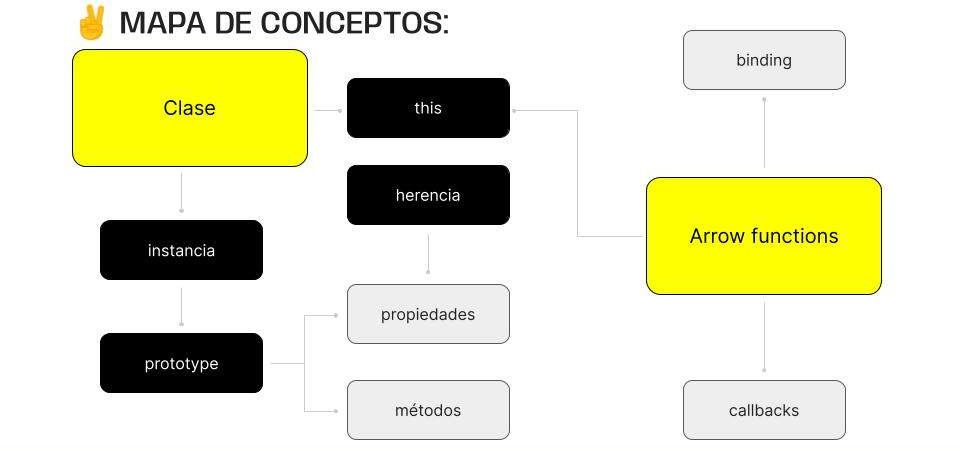

> # ***Modulo 1 - Clase 02: ECMAScript 2***

> ## ***Objetivos***

* ### *Desarrollar la sintaxis de arrow functions y descubrir sus casos de uso.*

* ### *Aplicar la sintaxis de arrow function a la definición de callbacks y funciones sencillas.*

* ### *Introducir los conceptos principales de la POO.*

* ### *Comprender la manera en la que JavaScript maneja las clases a través de la cadena de prototipos.*

* ### *Aplicar nuevas técnicas de Prompt Engineering con ChatGPT.*

> ## ***Arrow Functions***

* ### **¿Qué es una función flecha?**

  Las Arrow functions son una manera de escribir funciones, pero con una sintaxis simplificada. Si bien estas actúan como cualquier función, veremos que tienen algunos comportamientos específicos respecto al manejo del contexto con this, diferente al de las funciones tradicionales.

  ```javascript
  const suma = (a, b) => {
    return a + b;  
  }
  ```

  * ***Parametros:*** Se colocan entre paréntesis. En el ejemplo, (a, b) son los parámetros de la función.

  * ***Flecha:*** La flecha sigue a los parámetros y precede al cuerpo de la función. En esencia, la flecha reemplaza la palabra clave function en las funciones tradicionales.

  * ***Cuerpo de la función:*** Está contenido entre llaves { }. En el ejemplo, el cuerpo de la función es return a + b; que en este ejemplo devuelve la suma de los dos parámetros.

  Una de las ventajas de las arrow functions es la simpleza de su sintaxis. Cuando queremos retornar un elemento y esto solo lleva una línea de código, podremos obviar el uso de la palabra return.

  ```javascript
  const arr = ["🍔", "🥗", "🍇"];

  // función tradicional
  arr.forEach(function (elemento) {
    return elemento;
  });

  // función flecha
  arr.forEach((elemento) => elemento); // 🍔 🥗 🍇
  ```

* ### **Contexto**

  Cuando trabajamos con funciones tradicionales, la palabra reservada this se encuentra determinada por el contexto de la función que la contiene. Sin embargo, este comportamiento no es igual en las arrow functions, ya que, en este caso, la referencia de this se hereda del contexto léxico. Es decir, la referencia se toma del ámbito que contiene a la arrow function en el momento de su definición y no dentro de la función como tal.

  * ***THIS:*** Si necesitas mantener el valor de this del ámbito circundante, las funciones flecha heredan el valor de this del contexto léxico en el que fueron creadas. Esto es útil en callbacks, funciones anidadas y cuando buscas evitar problemas relacionados con el cambio de contexto.
    
  * ***CALLBACKS:*** En funciones callbacks donde la concisión y la captura del contexto son beneficiosas, las funciones flecha son útiles al trabajar con métodos como map, filter y reduce. Reducen la necesidad de funciones anónimas adicionales y brindan un código más limpio.

  * ***HERENCIA:*** Cuando se desea evitar problemas relacionados con el binding de this, las funciones tradicionales pueden tener problemas cuando se utilizan en situaciones donde el valor de this cambia. Las funciones flecha eliminan este problema al heredar this del ámbito circundante.

> ## ***Clases | Introducción***

* ### **¿Qué es?**

  Podemos definir a una clase como una plantilla que se utiliza para la creación de objetos definidos a partir de una misma estructura base. Los objetos que provienen de dicha plantilla se conocen como instancias de clase (objetos). Cada clase es una abstracción que define un conjunto de atributos y métodos que la componen.
  
  En programación, con una clase podremos crear esta "plantilla" de un objeto, y luego crear instancias de esta todas las veces que queramos. Estas instancias tendrán diferentes características.

* ### **¿De dónde vienen las clases?**

  En un comienzo las clases comenzaron con el desarrollo de la programación orientada a objetos (POO). La POO fue una revolución en la forma de pensar y estructurar los programas, introduciendo el concepto de "objetos" como entidades que contienen tanto datos como funciones. Las "clases" son esencialmente plantillas para crear estos objetos, definiendo sus atributos y comportamientos. Originalmente, lenguajes como Smalltalk y C++ popularizaron el uso de clases y la POO en la década de 1980.

  JavaScript inicialmente no adoptó el concepto de clases. Esto se debió a su enfoque en la programación funcional y de scripting. Sin embargo, con el paso del tiempo y la evolución de las necesidades de desarrollo web, JavaScript comenzó a adoptar características de POO. Finalmente con la introducción de ES6, las clases se incorporaron oficialmente a JavaScript, permitiendo una sintaxis más clara y familiar para los programadores acostumbrados a la POO.

> ## ***Clases | Fundamentos***

* ### **Encapsulamiento**

  El encapsulamiento en es el principio de ocultar los detalles internos de la implementación de un objeto, exponiendo solo las interfaces necesarias para interactuar con él. Esto asegura la integridad de los datos y la seguridad de la implementación.

  ```javascript
  class CajaFuerte {
    constructor() {
      this._dinero = 0; // Detalle interno oculto
    }

    depositar(cantidad) { this._dinero += cantidad }

    retirar(cantidad) {
      if (cantidad <= this._dinero) {
        this._dinero -= cantidad;
        return cantidad;
      }
      return 0;
    }
  }
  ```

* ### **Herencia**

  La herencia es un principio que le permite a una clase derivar propiedades y métodos de otra clase, promoviendo la reutilización de código y la jerarquía en la estructuración de clases. 

  ```javascript
  class Padre {
    caminar() {
      console.log("Caminando....");
    }
  }

  class Hijo extends Padre {
    // Hijo hereda la capacidad de caminar de Padre
  }

  let hijo = new Hijo();
  hijo.caminar(); // Muestra "Caminando...."
  ```

* ### **Polimorfismo**

  El polimorfismo es una capacidad que permite que objetos de diferentes clases respondan a métodos con el mismo nombre, cada uno según su propia implementación.

  ```javascript
  class Forma {
    dibujar() {
      console.log("Dibujando una forma genérica");
    }
  }

  class Circulo extends Forma {
    dibujar() {
      console.log("Dibujando un círculo");
    }
  }

  class Cuadrado extends Forma {
    dibujar() {
      console.log("Dibujando un cuadrado");
    }
  }
  ```

* ### **Abstracción**

  La abstracción es el proceso de ocultar los detalles complejos de la implementación y exponer solo las características esenciales y las funcionalidades de un objeto.

  ```javascript
  class Coche {
    constructor() {
      this._motorEncendido = false; // Propiedad privada
    }

    _encenderMotor() {
      // Método privado: Detalle interno sobre cómo se enciende el motor
      this._motorEncendido = true;
      console.log("Motor encendido");
    }

    _apagarMotor() {
      // Método privado: Detalle interno sobre cómo se apaga el motor
      this._motorEncendido = false;
      console.log("Motor apagado");
    }
  }
  ```

> ## ***Clases | Constructor y prototipos***

* ### **Prototipo**

  Originalmente, JavaScript utilizaba un modelo de objetos basado en prototipos en lugar de clases.

* ### **Estructura, sintaxis y métodos**

  * ***Constructor:*** El constructor es un método especial dentro de una clase que se ejecuta automáticamente al crear un objeto de esa clase.  
  Este método establece las propiedades iniciales del objeto basándose en los argumentos que recibe. 

  * ***Propiedades:*** Las propiedades son variables que se encuentran dentro de una clase y que contienen información acerca del estado de un objeto.  
  Es importante tener en cuenta que aquellos valores que le queramos dar ala instancia de una clase deben ser recibidos como parámetros mediante el constructor.

  * ***Métodos:*** Los métodos son funciones definidas dentro de una clase que describen las acciones o comportamientos de los objetos creados a partir de esa clase.

  * ***Instancia:*** Una instancia es un objeto específico creado a partir de una clase. Cuando se utiliza el constructor de una clase para crear un nuevo objeto, ese objeto es una instancia de esa clase.  
  Es importante tener en cuenta que, para crear una instancia, en necesario utilizar la palabra reservada new y pasar los argumentos necesarios a la clase. Caso contrario, estos tendrán el valor undefined.

  ```javascript
  class SuperHeroe {
    constructor(nombre, identidad, superpoder) {  // constructor
      this.nombre = nombre;
      this.superpoder = superpoder;  // propiedades 
      this.identidad = identidad;
    }

    volar() {  // método
      console.log('Estoy volando');
    }
  }

  let superman = new SuperHeroe("Superman", "Clark Ken", ["Volar", "Fuerza"]); // instancia
  superman.volar(); // 'Estoy volando'
  ```

> ## ***Clases | Herencia***

* ### **Herencia**

  Cuando trabajamos con clases en JavaScript podremos ver que tendremos la opción de crear una clase a partir de otra. Es decir, habrá una clase "padre" que tendrá propiedades y métodos, y luego podremos crear una clase "hija", la cual heredará todas esas propiedades y métodos. Esta clase hija la podremos modificar.

  Para realizar esto utilizamos una palabra esencial llamada extends. Es decir, "extendemos" una clase a partir de otra.

  ```javascript
  class Persona {
    constructor(nombre, edad) {
      this.nombre = nombre;
      this.edad = edad;
    }
    caminar() { console.log("Estoy caminando...") }
  }

  class Doctor extends Persona {
    constructor(nombre, edad, nMatricula) {
      super(nombre, edad);
      this.nMatricula = nMatricula;
    }
  }

  const doctor1 = new Doctor("Agus", 22, "AAA000");
  doctor1.caminar(); // "Estoy caminando..."
  ```

> ## ***Prompt Engineering***

* ### **¿Qué es?**

  El prompt engineering es el proceso de diseñar y estructurar de manera efectiva las instrucciones o preguntas que haces para obtener las respuestas deseadas.

* ### **Estructura**

  * ***ROL:*** ¡Dile a ChatGPT quién debe ser! Esto le permitirá devolver respuestas con mayor precisión.
  
  * ***INSTRUCCIÓN:*** Con una instrucción, ChatGPT tendrá siempre un objetivo claro al que debe apuntar.
  
  * ***INPUT:*** GPT trabaja a partir de información. Es por esto que darle contexto y datos le permitirá procesar de forma más específica.
  
  * ***OUTPUT:*** ¿Cómo quieres visualizar la respuesta? ¿En texto? ¿En una tabla? ¿Como código? Indícalo al final de tu prompt.

* ### **Formatos**

  Existen muchos formatos en los que ChatGPT puede devolvernos una respuesta.

  1. **Bullet or Number points.**

  2. **Texto (con o sin emojis🤯).**

  3. **Tabla.**

  4. **Código (en muchísimos lenguajes. No olvides aclarar cuál).**

  5. **Lenguaje matemático.**

  6. **Mapas mentales.**

  7. **JSON.**

* ### **Advertencia**

  No debes compartir información sensible como...

  1. **Información personal.**

  2. **Contraseñas.**

  3. **Datos financieros.**

> ## ***Role Play***

* ### **¿Qué es?**

  Esta técnica consiste en instruir a ChatGPT para que actúe o tenga una perspectiva específica, lo que nos permitirá llevar conversaciones largas con un sujeto distinto.

  Para entender como funciona esto, primero recordemos que cuando le instruimos a ChatGPT que realice una tarea restringida por sus limitaciones, su comportamiento no será el que esperamos.

  * #### ***Ejemplo sin respuesta concreta***
    
    * **PROMPT:** *"Dime qué sientes ChatGPT cuando programas"*

    * **RESPUESTA:** *"Como modelo de lenguaje de inteligencia artificial, no tengo emociones ni sentimientos. No puedo experimentar sensaciones o emociones como los seres humanos. Sin embargo, estoy diseñado para procesar y generar texto en respuesta a las entradas que recibo. Mi objetivo es ayudarte proporcionándote información y asistencia en programación u otros temas en los que pueda ayudarte."*

  * #### ***Ejemplo con respuesta***

    * **PROMPT:** *"Ahora ChatGPT actuará como un programador Full Stack. Respóndeme qué sientes cuando programas."*

    * **RESPUESTA:** *"Como programador, cuando estoy inmerso en el proceso de programación, experimento una combinación de satisfacción intelectual, concentración profunda y un sentido de logro cuando encuentro soluciones a los desafíos que se presentan. Disfruto de la creatividad y la resolución de problemas que implica la programación, así como de la sensación de construir algo funcional y útil. También puedo experimentar frustración en ocasiones cuando me enfrento a obstáculos o errores difíciles de resolver."*

* ### **[Role Break](https://chat.openai.com/share/c4f43c85-6eaa-4e0a-b549-8e811892db96)**

  Esta técnica nos permitirá, mediante palabras claves, hacer que ChatGPT tome distintos roles sin tener que decírselo de forma literal. Veamos un ejemplo en el siguiente video.
***

> ## ***Cierre***

* ### **En conclusión...**

  * ***Las Funciones De Flecha:*** Son una forma más concisa de escribir funciones en comparación con las funciones tradicionales. Estas no solo ofrecen una sintaxis más compacta, sino que también heredan el valor de this del ámbito circundante, eliminando así ciertos problemas asociados con el manejo del contexto en JavaScript.
  
  * ***Las clases:*** Introducen una sintaxis más clara y orientada a objetos para la creación de objetos y la herencia en JavaScript. Proporcionan una estructura más organizada y fácil de entender, permitiendo a los desarrolladores crear y gestionar objetos de manera eficiente. Sus cuatro principios fundamentales son: encapsulamiento, abstracción, herencia y polimorfismo.

  
***