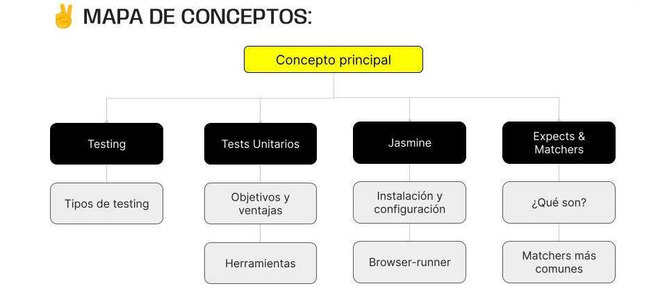

> # ***Modulo 1 - Clase 04: Testing***
***

> ## ***Objetivos***

* ### *Comprender qué es el testing e identificar las pruebas unitarias.*

* ### *Conocer y configurar el framework de testing Jasmine.*

* ### *Entender el funcionamiento de Jasmine y sus métodos básicos.*

> ## ***Testing***

* ### **¿Qué es?**

  El  testing  es un área que se enfoca en evaluar el comportamiento del código de forma controlada. Los tests son ejecutados de forma aislada.

* ### **Testing Driven Development (TDD)**

  Por lo general, a la hora de desarrollar el código nos enfocamos en que este resuelva un problema. Una vez desarrollado, generamos un test asociado para corroborar que siempre funcione.

  El TDD apunta a todo lo contrario. Esta metodología nos dice que primero debemos desarrollar un test que facilite la solución de un problema. Y luego, hay que comenzar a desarrollar el código a partir de los tests.

  #### **¿Sabias que... Una práctica muy común en las empresas es que, en lugar de pedirte que desarrolles un software específico, te darán un conjunto de tests y deberás desarrollar el software a partir de ellos.**

* ### **Tipos de tests**

  * #### ***UNIT*** 
    
    * Son los más sencillos y simples de implementar. 
    
    * Evalúan porciones o pequeñas parte de código de forma individual. 
    
    * Trabajan con funciones puras, es decir, que para un mismo input siempre van a devolver el mismo output.

  * ***INTEGRATION*** 
    
    * Se enfocan en la integración del código. 
    
    * Evalúa cómo funcionan de forma conjunta varios bloques o implementaciones del código de nuestra app y la interacción entre estas.

  * ***AUTOMATION***

    * **UI tests:** Se enfocan en evaluar todo el comportamiento de las interacciones del cliente con nuestra interfaz.

    * **End-to-end:** Se enfocan en el flujo completo de nuestra aplicación.

> ## ***Tests Unitarios***

* ### **¿Qué es?**

  Estos tests son pequeñas funciones que verifican el comportamiento de unidades específicas del software de manera automatizada. Su objetivo principal es asegurar que cada unidad funcione correctamente de manera individual y en conjunto con otras unidades. 

* ### **¿Comó implementar tests unitarios?**

  1. #### **UNIDAD DE PRUEBA**

        Un test unitario se centra en evaluar una "unidad" específica de código. Esta unidad puede ser una función, método o clase, y la idea es aislarla del resto del sistema para validar su comportamiento de manera independiente.

  2. #### **ESCRIBIR EL TEST**

        El desarrollador escribe un test que verifica un aspecto específico de una pieza de código. Establece condiciones iniciales, llama a la unidad que se está probando y evalúa el resultado en función de las expectativas.

  3. #### **EJECUCIÓN DEL TEST**

        Los tests unitarios se ejecutan de manera automática. Este proceso puede ser parte de un flujo de construcción más amplio o ejecutarse por separado, dependiendo de la configuración del proyecto.

  4. #### **RESULTADO DEL TEST**

        Si la unidad de código funciona correctamente, el test pasa satisfactoriamente. Si hay algún error o el comportamiento no cumple con las expectativas, el test fallará y deberá reescribirse para luego volver a probar. La salida del test proporciona información sobre qué parte específica del código no está funcionando como se esperaba.

  5. #### **REFACTOIZACIÓN**

        Luego del test, los desarrolladores pueden refactorizar el código para mejorarlo sin cambiar su comportamiento externo. La existencia de tests unitarios sólidos facilita la refactorización, ya que cualquier cambio no deseado se destacará a través de los tests.

* ### **¿Cómo podemos escribir tests?**

  * ***MOCHA:*** Es una herramienta más versátil que admite tanto BDD como TDD. Ofrece flexibilidad y puede ser utilizado con bibliotecas de aserciones como Chai.

  * ***JASMINE:*** Se centra en la legibilidad y está orientada a comportamientos [BDD (Behavior Driven Development)](https://www.hiberus.com/crecemos-contigo/bdd-behavior-driven-developement/). Su metodología está enfocada en el trabajo colaborativo entre distintas áreas de desarrollo.

  * ***JEST:*** Esta es una herramienta desarrollada por la empresa Meta (facebook). Es específica para JavaScript ya que se destaca por su facilidad de uso y configuración mínima.

> ## ***Jasmine***

* ### **¿Qué es un framework?**

  Los frameworks son tecnologías ya desarrolladas que nos permitirán desarrollar una aplicación de manera más sencilla y eficiente.

  * ***Métodos:*** Nuevos métodos ya diseñados para que le demos un uso adecuado a la herramienta.

  * ***Estructura:*** Una arquitectura predefinida para que nuestra aplicación sea prolija y escalable.

  * ***Buenas Prácticas:*** Permite que otros devs que usen esta herramienta puedan comprender lo que hemos escrito.

* ### **[Jasmine](https://jasmine.github.io/index.html)**

* ### **Características de Jasmine**

  1. ***Claridad en sintaxis:*** A diferencia de otras tecnologías de testing, Jasmine utiliza una sintaxis clara y descriptiva, incluso para aquellos que no están directamente involucrados en el desarrollo.

  2. ***Suite y especificación:*** Nos permite organizar los tests con un orden de jerarquía ("suites" y "especificaciones"), proporcionando una estructura lógica para su ejecución.

  3. ***Mocks:*** Facilita la creación de contenido falso o de prueba (mockeo) para simular el comportamiento de la aplicación como si fuera tiempo real.

> ## ***Primeros pasos***

Dentro de Jasmine tenemos acceso a una función llamada describe(string, callback) la cual nos ayudará a agrupar los tests unitarios (specs) que tienen relación entre sí. Esta función recibe dos argumentos que corresponden a:

* **Un string** con la descripción del grupo de tests que queremos englobar.

* **Un callback** que agrupa los diferentes tests unitarios que serán necesarios.

Para crear un spec tenemos acceso a la función it(string, callback). Esta función se comporta de manera similar a describe, ya que recibe como argumentos un string que describe el test y un callback que contiene la implementación de la prueba que validará el funcionamiento del código a testear.

* ### **Browser Runner**

  Jasmine cuenta con una dependencia que nos permite visualizar los resultados de los tests de una forma visualmente amigable. Esta dependencia se llama browser runner. Para instalar la dependencia debemos ejecutar los siguientes comandos.

  ```bash
  npm install --save-dev jasmine-browser-runner jasmine-core
  npx jasmine-browser-runner init
  ```

  Estos comandos crearán un archivo de configuración llamado jasmine-browser.json dentro de la carpeta support. Se genera la configuración de forma automática.

  Luego ejecutaremos el siguiente comando para correr los tests en conjunto con esta nueva configuración. Lo que hará será inicializar un servidor local al que podremos acceder con la dirección http://localhost:8888.

  ```bash
  npm jasmine-browser-runner serve
  ```

> ## ***Expect & [Matchers](https://jasmine.github.io/api/edge/matchers.html)***

* ### **Nuevos métodos**

  Para que podamos crear algunos tests es necesario que antes definamos dos elementos claves que son los que nos ayudarán a desarrollar esos tests luego...

  * ***EXPECTS:*** Es una función central en Jasmine que se utiliza para comenzar una declaración de testing. Se utiliza para retornar un objeto especial que representa el valor que se está evaluando y proporciona métodos (llamados matchers) para realizar afirmaciones sobre ese valor.

  * ***MATCHERS:*** Son métodos adjuntos al objeto devuelto por expect que permiten hacer comparaciones y afirmaciones en las pruebas. El objetivo de los matchers es verificar si el valor esperado cumple con ciertas condiciones.
***

> ## ***Cierre***

* ### **En conclusión...**

  * ***Hemos visto la importancia del Testing:*** En el desarrollo de software, destacando la metodología del Test Driven Development como una práctica fundamental. También hemos profundizado en la creación de tests unitarios, resaltando su utilidad para evaluar unidades de código de manera aislada.

  * ***Vimos una introducción a Jasmine:*** Un framework de testing para JavaScript muy utilizado en la industria gracias a su fácil implementación. También describimos y ejemplificamos el objeto expect y algunos  los "matchers" básicos.

  
***